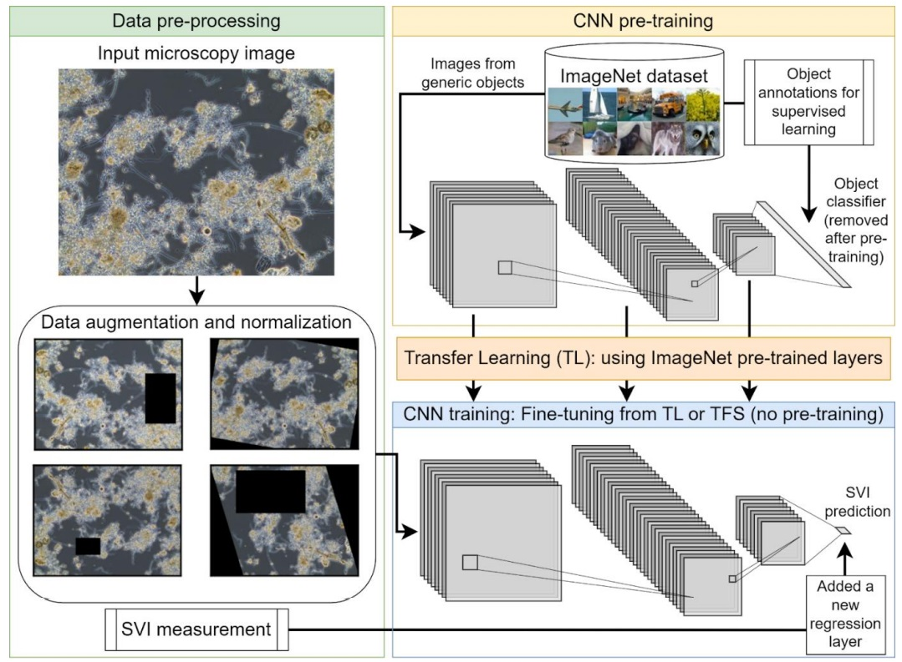
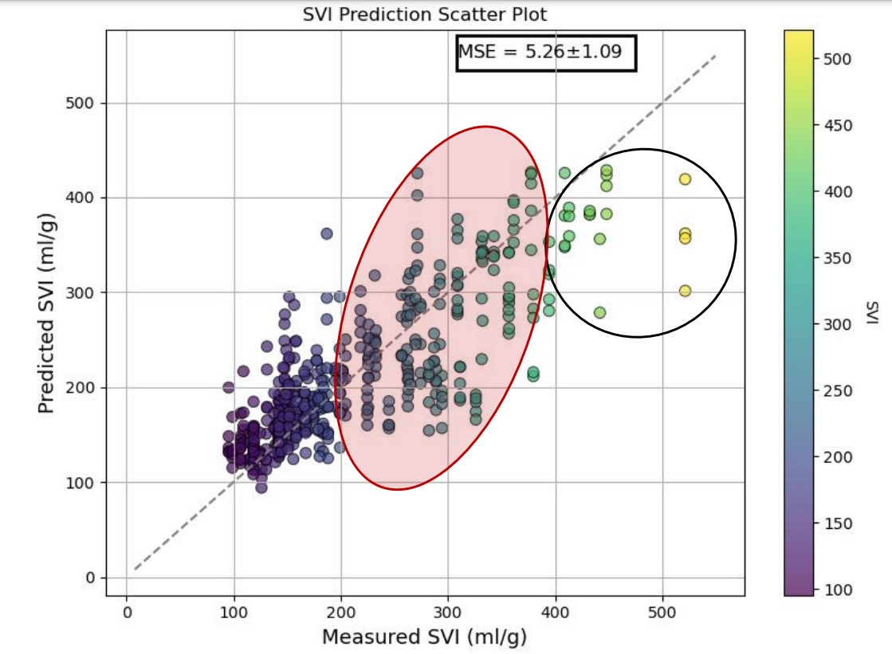

# Prediction of Activated Sludge Settling Characteristics from Microscopy Images with Deep Convolutional Neural Networks and Transfer Learning


This study presents an innovative computer vision-based approach to assess activated sludge-settling characteristics based on the morphological properties of flocs and filaments in microscopy images. Implementing the transfer learning of deep convolutional neural network (CNN) models, this approach aims to overcome the limitations of existing quantitative image analysis techniques. The offline microscopy image dataset was collected over two years, with weekly sampling at a full-scale industrial WWTP in Belgium. Multiple data augmentation techniques were employed to enhance the generalizability of the CNN models. Various CNN architectures, including Inception v3, ResNet18, ResNet152, ConvNeXt-nano, and ConvNeXt-S, were tested to evaluate their performance in predicting sludge settling characteristics. The sludge volume index (SVI) was used as the final prediction variable, but the method can easily be adjusted to predict any other settling metric of choice.

<p align="center">
    
</p>

The results showed that the suggested CNN-based approach provides less labour-intensive, objective, and consistent assessments while transfer learning notably minimises the training phase, resulting in a generalizable system that can be employed in real-time applications. 

<p align="center">
    
</p>

## Usage

* Check ```NN_training.py```
```
python NN_training.py --help
```
* !!! You will need a torch vision dataloader in ```dataset.py``` designed for your dataset. This file is omitted here since our dataset is not public.

 * However, you can download our [weights for ConvNeXt-nano here](https://drive.google.com/drive/folders/1mY77rGV0B2MxhwCmZ0B1mkp9S4J-r3d2?usp=sharing), allowing you to use our trained models on different data.

## Requirements

* torch
* timm
* sklearn


## Setup used for experiments

* Linux Ubuntu x86-64 18.04.5 LTS (Bionic Beaver)
* Intel(R) Core(TM) i7-7820X CPU @ 3.60GHz, 64GB RAM
* GTX 1080 ti, NVIDIA driver Version: 470.141.03, CUDA Version: 11.4


## Credits

If you use our code or methods, please cite the paper:


